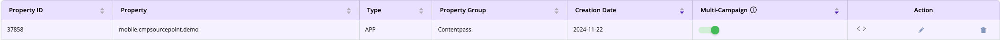
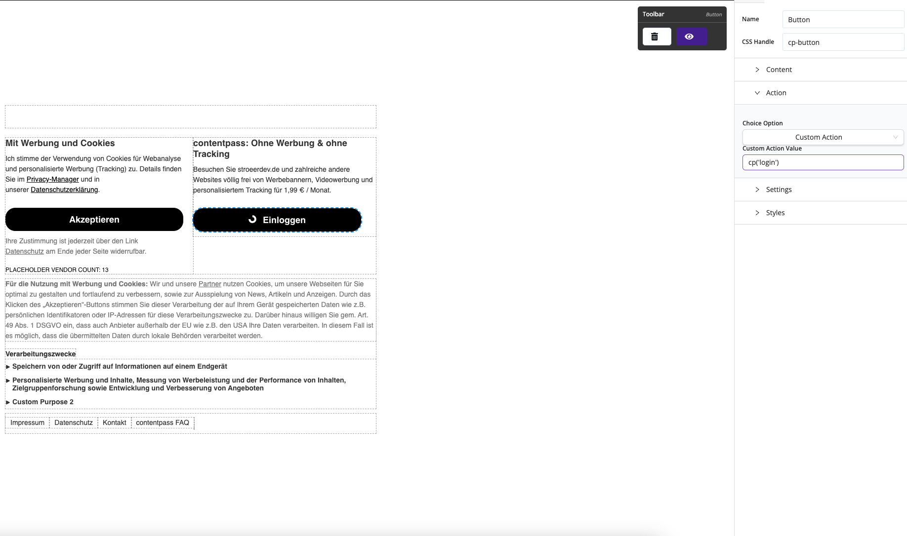

# Integration with Sourcepoint SDK
The Contentpass SDK can be seamlessly integrated with the Sourcepoint SDK to manage consent. Since the Sourcepoint SDK
is a separate React Native package, you must install it independently. For detailed guidance, refer to the
[Sourcepoint SDK documentation](https://github.com/SourcePointUSA/react-native-sourcepoint-cmp).


## Setting Up Sourcepoint
To use the Sourcepoint SDK, follow these steps:

1. Create a Sourcepoint Account: Set up a Sourcepoint account and create a property with the type APP.
2. Configure the Property, ensure the property includes:
   - Campaigns
   - Partition Sets
   - Scenarios (with the `acps` parameter — see [here](https://docs.contentpass.net/docs/onboarding/cmp/sourcepoint#4-sourcepoint-contentpass-integration) for details)
   - Messages

For more information, consult the [Sourcepoint documentation](https://docs.sourcepoint.com/hc/en-us).

A newly created property should resemble the following example:


### Adding a Custom Action to Sourcepoint Messages
To integrate the Sourcepoint SDK with the Contentpass SDK, you must define a custom action in Sourcepoint Messages:
1. Navigate to `Messages` > `GDPR Messages` > `Web / Webview (TCF)`.
2. Edit the relevant message and add a custom action to the login button, such as `cp('login')`.
3. This custom action will authenticate users through the Contentpass SDK.

Example configuration:


## Code Integration
After setting up Sourcepoint, install its SDK package. Use the following code to integrate Contentpass and Sourcepoint
SDKs in your app.

### Important note
After creating a property in Sourcepoint, you must wait approximately 15 minutes before it becomes available for use
with the `@sourcepoint/react-native-cmp package`. This delay allows the configuration to propagate.

### Implementation
Install the Sourcepoint SDK package, then use the following code to integrate the two SDKs in your app:

```jsx
import { useEffect, useRef, useState } from 'react';
import { SPConsentManager } from '@sourcepoint/react-native-cmp';
import { ContentpassStateType, useContentpassSdk } from '@contentpass/react-native-contentpass';

const sourcePointConfig = {
  accountId: 'SOURCEPOINT_ACCOUNT_ID',
  propertyId: 'SOURCEPOINT_PROPERTY_ID',
  propertyName: 'SOURCEPOINT_PROPERTY_NAME',
};

const setupSourcepoint = (hasValidSubscription) => {
  const { accountId, propertyName, propertyId } = sourcePointConfig;
  const spConsentManager = new SPConsentManager();

  spConsentManager.build(accountId, propertyId, propertyName, {
    gdpr: {
      targetingParams: {
        acps: hasValidSubscription ? 'true' : 'false',
      },
    },
  });

  return spConsentManager;
};

const App = () => {
  const [authResult, setAuthResult] = useState();
  const contentpassSdk = useContentpassSdk();
  const spConsentManager = useRef();

  useEffect(() => {
    const onContentpassStateChange = (state) => {
      setAuthResult(state);
    };

    contentpassSdk.registerObserver(onContentpassStateChange);

    return () => {
      contentpassSdk.unregisterObserver(onContentpassStateChange);
    };
  }, [contentpassSdk]);

  useEffect(() => {
    // wait for the authResult to be set before setting up Sourcepoint
    if (!authResult || authResult.state === ContentpassStateType.INITIALISING) {
      return;
    }

    spConsentManager.current = setupSourcepoint(
      authResult.hasValidSubscription || false
    );

    spConsentManager.current?.onAction((action) => {
      if (action.customActionId === "cp('login')") {
        contentpassSdk.authenticate()
      }
    });

    spConsentManager.current?.loadMessage();

    return () => {
      spConsentManager.current?.dispose();
    };
  }, [authResult, contentpassSdk]);

  return (
    //   Your app content
  )
}
```

## Troubleshooting
While integrating the Contentpass SDK with Sourcepoint SDK (version `0.3.0`), you may encounter known issues. Pull requests
addressing these issues have been submitted in the [Sourcepoint GitHub repository](https://github.com/SourcePointUSA/react-native-sourcepoint-cmp):
- [PR #10](https://github.com/SourcePointUSA/react-native-sourcepoint-cmp/pull/10)
- [PR #11](https://github.com/SourcePointUSA/react-native-sourcepoint-cmp/pull/11)

### Temporary Fixes
If these fixes are not yet available in the latest version of the SDK, you can patch node_modules in your project using
tools like `yarn patch` or similar. The patch files can be found here:
- Patch for [PR #10](https://github.com/SourcePointUSA/react-native-sourcepoint-cmp/pull/10): [@sourcepoint-react-native-cmp-npm-0.3.0-2434c31dc9.patch](./sourcepoint-patches/@sourcepoint-react-native-cmp-npm-0.3.0-2434c31dc9.patch)
- Patch for [PR #11](https://github.com/SourcePointUSA/react-native-sourcepoint-cmp/pull/11): [@sourcepoint-react-native-cmp-patch-34fca36663.patch](./sourcepoint-patches/@sourcepoint-react-native-cmp-patch-34fca36663.patch)

We hope these issues will be resolved in the next release of the Sourcepoint SDK, eliminating the need for manual patches.
